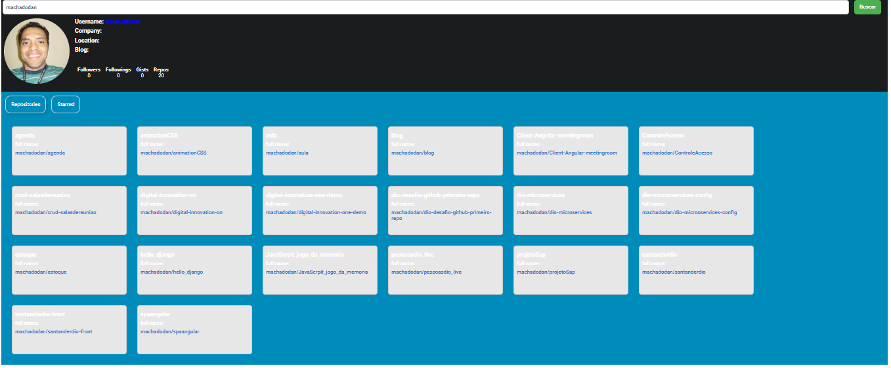

# Bootcamp TQI | FullStack Developer
Projeto final módulo IV ReactJS - Criando um front-end componentizado na prática com React

## Sobre o projeto
Este repositório foi criado para mostrar como podemos criar uma aplicação frontend com componentes reutilizáveis.

Aplicativo usando a API pública do github.

### Características
•	Pesquisar informações por nome de usuário
•	Pesquisar repositório por nome de usuário
•	Pesquisa com estrela por nome de usuário

### Visualizar
Impressão do projeto finalizado.

## Mudanças Realziadas do projeto original
•	Alteração cores: 
•	Background, botões
•	Repository
•	fonts-color
•	Repository-items

### Bibliotecas usadas
•	axios
•	guias de reação
•	componentes estilizados

Scripts Disponíveis
No diretório do projeto, você pode executar:

yarn start
Executa o aplicativo no modo de desenvolvimento.
Abra http://localhost:3000 para visualizá-lo no navegador.
A página será recarregada se você fizer edições.

## Curso ministrado por: Matheus Benites 
